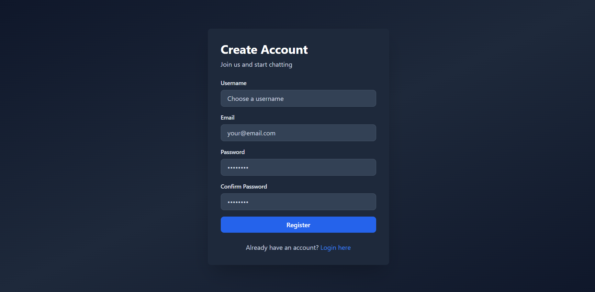
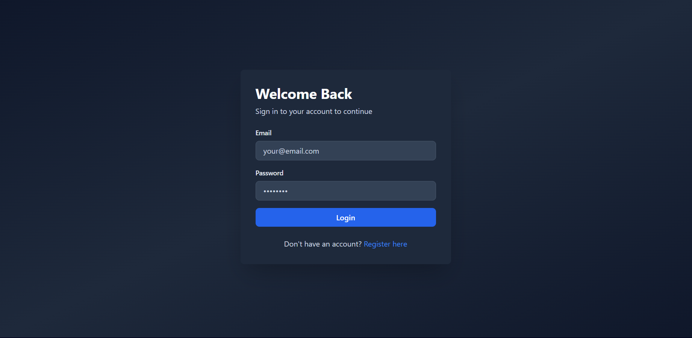
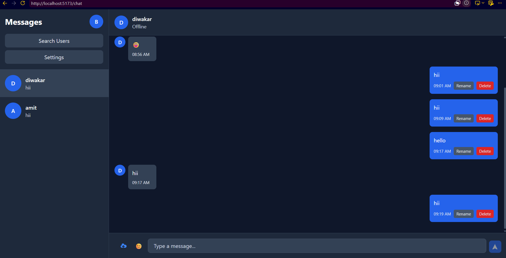

<<<<<<< HEAD
# Real-Time Chat Application

A full-stack, real-time chat application built with the MERN stack (MongoDB, Express, React, Node.js) and WebSocket technology for instant messaging, user presence tracking, and more.

## Features

### Authentication
- **User Registration** - Create new user accounts with validation
- **Login** - Secure user authentication
- **Logout** - Proper session termination
- **JWT Authentication** - Secure token-based authentication
- **Password Encryption** - bcryptjs for secure password hashing

### User Management
- **Search Users** - Find and connect with other users
- **Online Users** - View who's currently online
- **Offline Users** - See when users were last active
- **User Profile** - View and edit user profiles
- **User Status** - Real-time online/offline status indicators

### Chat Features
- **One-to-One Chat** - Direct private messaging
- **Real-Time Messaging** - Instant message delivery via WebSocket
- **Message Seen Status** - Know when messages are seen
- **Typing Indicator** - See when someone is typing
- **Read Receipts** - Confirm message delivery and reading
- **Last Message Preview** - Quick peek at conversation previews
- **Message Deletion** - Remove messages from conversations
- **Infinite Scroll** - Load more messages as you scroll

### Media Sharing
- **Image Sharing** - Send images in conversations
- **PDF Sharing** - Share documents
- **Emoji Support** - Full emoji picker for expressive messaging

### Notifications
- **Sound Notifications** - Audio alerts for new messages (optional)
- **Browser Notifications** - Desktop notifications for chat activity

### Advanced Features
- **Dark Mode** - Eye-friendly dark theme (enabled by default)
- **Mobile Responsive** - Fully responsive design for all devices
- **Auto Scroll** - Automatically scroll to latest messages
- **Interactive UI** - Smooth animations and transitions
- **User Presence** - Live online status updates

## Project Structure

```
Real-Time-Chat-App/
│
├── client/                          # React Frontend
│   ├── src/
│   │   ├── components/              # Reusable React components
│   │   │   ├── Sidebar.jsx
│   │   │   ├── ChatWindow.jsx
│   │   │   ├── MessageList.jsx
│   │   │   ├── MessageInput.jsx
│   │   │   ├── ConversationList.jsx
│   │   │   └── UserSearch.jsx
│   │   ├── pages/                   # Page components
│   │   │   ├── Login.jsx
│   │   │   ├── Register.jsx
│   │   │   └── ChatPage.jsx
│   │   ├── redux/                   # Redux state management
│   │   │   ├── store.js
│   │   │   ├── authSlice.js
│   │   │   └── chatSlice.js
│   │   ├── hooks/                   # Custom React hooks
│   │   │   ├── useApi.js            # API calls
│   │   │   └── useSocket.js         # Socket.io integration
│   │   ├── App.jsx                  # Main App component
│   │   ├── main.jsx                 # Entry point
│   │   └── index.css                # Global styles
│   ├── index.html                   # HTML template
│   ├── package.json
│   ├── vite.config.js               # Vite configuration
│   ├── tailwind.config.js           # Tailwind CSS config
│   ├── postcss.config.js            # PostCSS config
│   └── .env.local                   # Environment variables
│
├── server/                          # Node.js Backend
│   ├── controllers/                 # Route handlers
│   │   ├── authController.js
│   │   └── messageController.js
│   ├── routes/                      # API routes
│   │   ├── authRoutes.js
│   │   └── messageRoutes.js
│   ├── middleware/                  # Express middleware
│   │   ├── auth.js                  # JWT authentication
│   │   └── errorHandler.js          # Error handling
│   ├── models/                      # MongoDB schemas
│   │   ├── User.js
│   │   ├── Message.js
│   │   └── Conversation.js
│   ├── socket/                      # WebSocket setup
│   │   └── socketHandler.js
│   ├── config/                      # Configuration files
│   │   ├── db.js                    # Database connection
│   │   ├── jwt.js                   # JWT utilities
│   │   └── env.example
│   ├── server.js                    # Express server entry point
│   ├── package.json
│   └── .env                         # Environment variables
│
└── README.md                        # This file
```

## Prerequisites

- **Node.js** (v14.0.0 or higher)
- **npm** or **yarn**
- **MongoDB** (Local or Atlas Cloud Database)

## Installation

### 1. Clone the Repository

```bash
git clone <repository-url>
cd Real-Time-Chat-App
```

### 2. Setup Backend (Server)

```bash
cd server

# Install dependencies
npm install

# Create .env file and configure
cp config/env.example .env

# Edit .env with your configuration
# MONGODB_URI=your_mongodb_connection_string
# JWT_SECRET=your_secret_key

# Start the server
npm run dev
```

The server will run on `http://localhost:5000`

### 3. Setup Frontend (Client)

```bash
cd ../client

# Install dependencies
npm install

# Create .env file
cp .env.example .env.local

# Start the development server
npm run dev
```

The client will run on `http://localhost:5173`

## Configuration

### Server Environment Variables (.env)

```env
# MongoDB Connection
MONGODB_URI=mongodb://localhost:27017/chat-app

# JWT Configuration
JWT_SECRET=your_jwt_secret_key_here
JWT_EXPIRY=7d

# Server Configuration
PORT=5000
NODE_ENV=development
CORS_ORIGIN=http://localhost:5173

# Socket.io Configuration
SOCKET_PING_INTERVAL=25000
SOCKET_PING_TIMEOUT=60000
```

### Client Environment Variables (.env.local)

```env
VITE_API_URL=http://localhost:5000/api
VITE_SOCKET_URL=http://localhost:5000
```

## API Endpoints

### Authentication
- `POST /api/auth/register` - Register a new user
- `POST /api/auth/login` - Login user
- `POST /api/auth/logout` - Logout user
- `GET /api/auth/profile` - Get user profile
- `PUT /api/auth/profile` - Update user profile
- `GET /api/auth/search?query=...` - Search users
- `GET /api/auth/online-users` - Get list of online users

### Messaging
- `POST /api/messages/send` - Send a message
- `GET /api/messages/get?receiverId=...&page=...` - Get messages
- `POST /api/messages/mark-read` - Mark message as read
- `POST /api/messages/mark-seen` - Mark message as seen
- `GET /api/messages/conversations` - Get all conversations
- `DELETE /api/messages/delete` - Delete a message

## WebSocket Events

### Client → Server
- `typing` - User is typing
- `stop_typing` - User stopped typing
- `send_message` - Send message in real-time
- `message_read` - Message read receipt
- `message_seen` - Message seen receipt
- `initiate_call` - Start a voice/video call
- `call_answer` - Answer incoming call
- `call_decline` - Decline incoming call
- `call_end` - End call

### Server → Client
- `user_online` - User came online
- `user_offline` - User went offline
- `online_users_updated` - List of online users updated
- `receive_message` - Receive message in real-time
- `message_read_receipt` - Receipt for read message
- `message_seen_receipt` - Receipt for seen message
- `user_typing` - Someone is typing
- `user_stop_typing` - Someone stopped typing
- `incoming_call` - Incoming voice/video call
- `call_answered` - Call was answered
- `call_declined` - Call was declined
- `call_ended` - Call ended

## Technology Stack

### Frontend
- **React 18** - UI library
- **Redux Toolkit** - State management
- **React Router** - Client-side routing
- **Axios** - HTTP client
- **Socket.io Client** - WebSocket client
- **Tailwind CSS** - Utility-first CSS
- **Vite** - Build tool
- **Emoji Picker React** - Emoji selection
- **React Hot Toast** - Notifications
- **Framer Motion** - Animations

### Backend
- **Node.js** - Runtime environment
- **Express.js** - Web framework
- **MongoDB** - Database
- **Mongoose** - ODM
- **Socket.io** - WebSocket library
- **JWT** - Authentication
- **bcryptjs** - Password hashing
- **Cors** - Cross-Origin Resource Sharing
- **Multer** - File uploads

## Usage

### Register a New Account
1. Click "Register" on the login page
2. Fill in username, email, and password
3. Confirm password and submit
4. You'll be logged in automatically

### Login
1. Enter your email and password
2. Click "Login"
3. You'll be redirected to the chat page

### Start Chatting
1. Click "Search Users" in the sidebar
2. Search for a user by username or email
3. Click on a user to start a conversation
4. Type a message and press Enter or click Send
5. See real-time delivery and read receipts

### Share Media
1. Click the image icon to share an image
2. Click the emoji icon to add emojis
3. Attach images or PDFs to your messages

### Manage Profile
1. Click your avatar in the top-right corner
2. View or update your profile information
3. Change your bio or avatar

## Key Features Implementation

### Real-Time Messaging
- Uses WebSocket (Socket.io) for instant message delivery
- Messages sync across multiple devices
- Typing indicators show when someone is composing

### Message Status
- **Sent** - Message delivered to server
- **Read** - Message read by recipient
- **Seen** - Message seen by recipient

### User Presence
- Real-time online/offline status
- Last seen timestamp for offline users
- Online users list

### Security
- JWT token-based authentication
- Password encryption with bcryptjs
- Protected API routes
- CORS enabled

## Scripts

### Server
```bash
npm start       # Start production server
npm run dev     # Start development server with auto-reload
```

### Client
```bash
npm run dev     # Start development server
npm run build   # Build for production
npm run preview # Preview production build
```

### Screenshot

 ## Login Page



## Sign In Page




## Chat Page



## Troubleshooting

### Connection Issues
- Ensure MongoDB is running
- Check if ports 5000 and 5173 are available
- Verify environment variables are correctly set

### WebSocket Connection Failed
- Check if Socket.io is properly installed
- Verify CORS settings match your frontend URL
- Check browser console for detailed error messages

### Messages Not Sending
- Ensure you're logged in
- Check network tab for API errors
- Verify JWT token is valid

## Future Enhancements

- Group chat functionality
- Voice and video calling
- Message encryption
- User blocking feature
- Message reactions
- Custom themes
- File sharing beyond images and PDFs
- Message search functionality
- Push notifications
- User activity status (away, busy, etc.)

## License

This project is open source and available under the MIT License.

## Contributing

Contributions are welcome! Please feel free to submit pull requests or open issues for bugs and feature requests.

## Support

For issues and questions, please open an issue on the GitHub repository.

---

**Happy Chatting!** 💬
=======
# ChatApplication
>>>>>>> fb392df80fe21799831fb966959d05a78e8c3554
